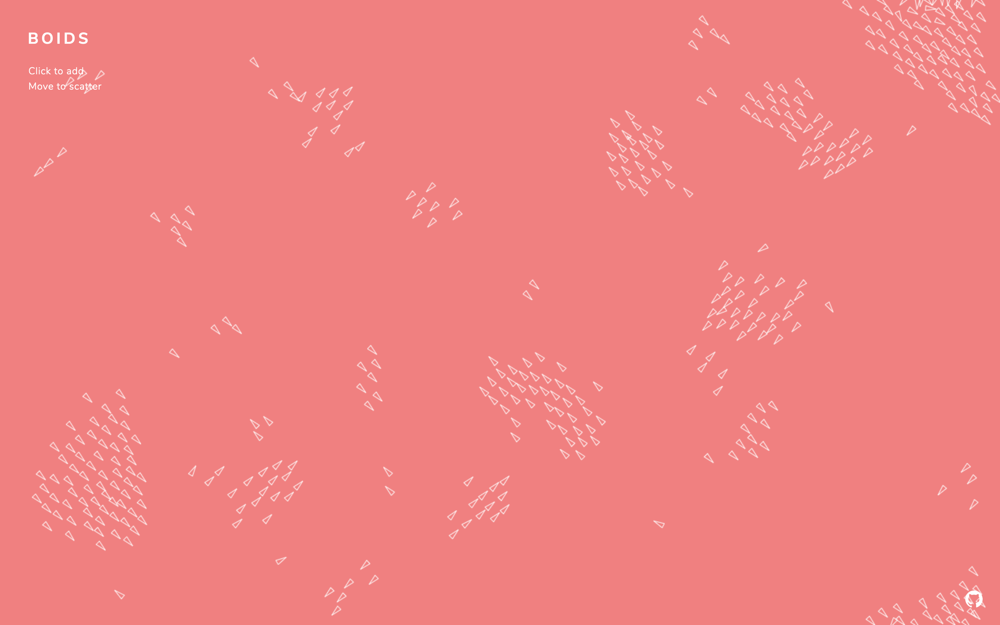

# Boids

Toy program simulating flocking behaviour.  
Based off of the artificial life program 'Boids' by Craig Reynolds.

## Todos

* ~~Bug – boids only seem to move diagonally~~
* Weird boid 360 spins due to improper angle rounding
* Adjustable parameters (max speed, variable size, colour, forces)

